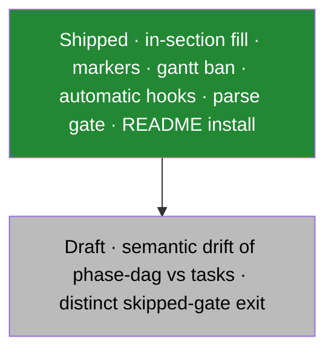

# Continue Here

This file is the handoff from the org-factory session that published this
extension. Open this repository as the workspace. Do not put further diagram
research, prior-art reports, or session notes back into org-factory.

## Where things are

| What | Path |
|---|---|
| Prior-art inventory (39 extensions) | `docs/research/prior-art/inventory.md` |
| Prior-art consensus report | `docs/research/prior-art/report.md` |
| This publish + Q&A + prior-art session | `docs/research/sessions/2026-09-12-publish-and-prior-art/session.jsonl` |
| PriorArtReviewer subagent transcript | `docs/research/sessions/2026-09-12-publish-and-prior-art/PriorArtReviewer.jsonl` |
| Earlier extension-design session | `docs/research/sessions/2026-09-12-extension-design/session.jsonl` |

Session JSONL files are local only (gitignored). They are not on GitHub.

## State of the extension

- Public repo: https://github.com/DgxSparkLabs/spec-kit-diagrams
- `extension.yml` version 1.1.0; hooks `optional: false` on
  `after_specify` / `after_plan` / `after_tasks`. Tag `v1.0.0` still has
  `optional: true`.
- README install uses `specify extension add --dev <path>` (specify 1.0.5)
  and the `v1.1.0` tag archive. It also records the `--force` nested-`.git`
  lock, the `ascii-diagram` co-install ban, disable as the opt-out, and
  skipped-gate is not a pass.

Which follow-through is shipped, and what stays draft?

## What stayed in org-factory (do not move)

- `.specify/templates/visual-conventions.md` (stub pointing here)
- `.agents/rules/diagrams.md` (org-factory parse gate)
- `scripts/validate-mermaid.mjs` and its tests (org-factory CI)
- `--dev` install under `.specify/extensions/` (local, uncommitted)

## Consensus locks (from the report)

1. Keep in-section agent fill + parse gate. No catalog extension ships that layout.
2. Keep `<!-- SPECKIT DIAGRAM:<id> START/END -->`.
3. `gantt` stays banned.
4. Parse skipped is not passed.
5. `optional: false` stays. Co-install YAML order is not locked.
6. Do not co-install `ascii-diagram` on the same hooks.

## Original session ids

- Publish / Q&A / prior art: `01a0979b-db29-7429-b0fd-6a4e09d75d03`
  (cwd was `C:\Users\devic\source\org-factory`)
- Extension design: `01a096fc-c44a-7690-bc84-76abe5d1ec4c`

## Applied 2026-09-13

README now matches specify 1.0.5 `--dev` syntax, points install at `v1.1.0`,
and states the co-install ban, disable opt-out, and skipped-is-not-pass
wording from the consensus report. Semantic drift detection and a distinct
validator exit for skipped remain draft.
