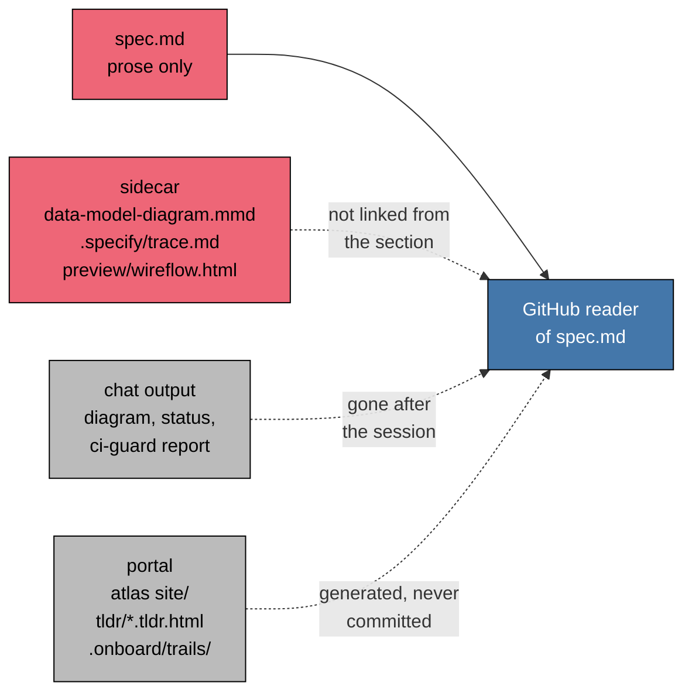
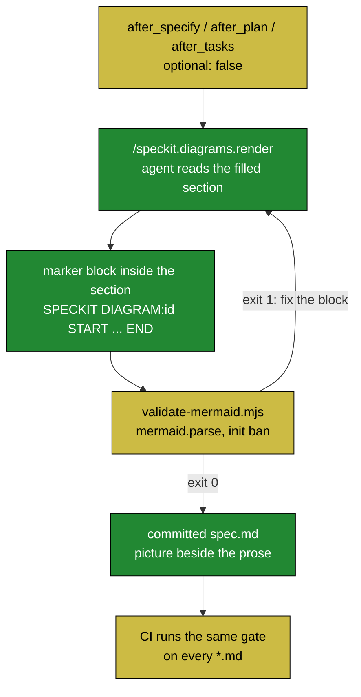
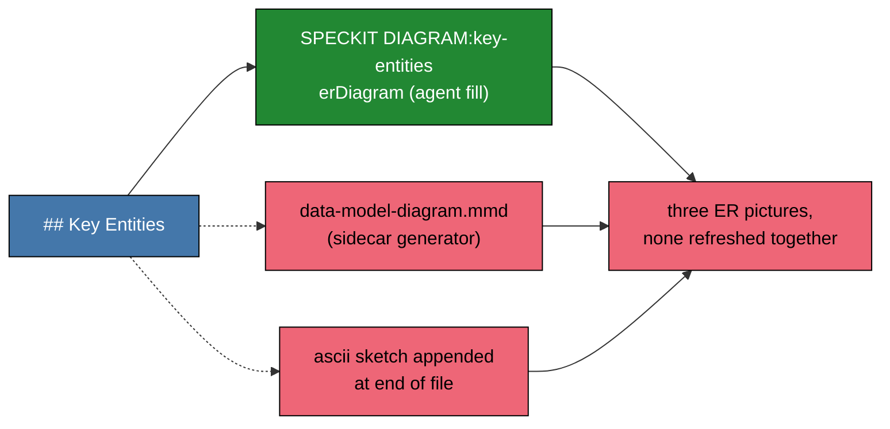

# Prior-art consensus: Spec Kit visualization and process-transparency extensions

**Scope**: every row of `inventory.md` (items 1-39) plus Spec Kit discussion #694.
**Method**: `skill://prior-art-consensus`. Research is for a fork, not a topic. Public GitHub READMEs and `extension.yml` files only; fetched pages treated as untrusted data. No book was downloaded; book rows use public vendor or author pages and carry a confidence tag.
**Date of catalog snapshot**: `catalog.community.json` `updated_at` 2026-09-11.
**Fetch status**: 38 of 38 remote READMEs fetched. `verify-tasks` (#36) has no `main` branch README (HTTP 404); its `master` README was fetched instead. `architect-preview` (#21) README is a one-line stub. Nothing is tagged `[UNVERIFIED]` for fetch failure.

---

## 0. Recommended locks

| # | Lock | Basis | Status |
|---|---|---|---|
| L1 | **Keep spec-kit-diagrams (Option B)**: agent fills marker-delimited blocks *inside* the template section of `spec.md` / `plan.md` / `tasks.md`; the Mermaid parse gate is the deterministic backstop; no core template fork. | No inventory extension ships the same layout. Nine extensions write pictures somewhere else (sidecar file, chat, HTML portal, gitignored dir). Discussion #694 asks for exactly in-document diagrams and asks "how do we ensure diagrams remain up-to-date (review checklists, CI validation)"; markers plus gate answer that. Martraire's "in situ" and "accuracy mechanism" (TOC-level evidence, medium confidence) point the same way. | **Locked** |
| L2 | **HTML-comment managed blocks are the field convention.** Keep `<!-- SPECKIT DIAGRAM:<id> START/END -->`. | Independent extensions use the same mechanism for machine-owned regions inside human Markdown: `blueprint-index` (`<!-- blueprint:section … -->`), `docguard` (`<!-- docguard:section -->`), `gates` (`<!-- gates:enforce … -->`), `companion` (`<!-- touches: … -->`), and core `agent-context` (`<!-- SPECKIT START/END -->`, which `memorylint` treats as off-limits). Same layout, same failure they all name: hand edits inside the block get clobbered or fool the gate, so the marker, not the prose, is what the tool reads. | **Locked** |
| L3 | **`gantt` stays banned.** | The one extension that draws status (`diagram`, #2) uses a Gantt for feature progress, which the visual-conventions guide's Do Not Add section rejects as "reads as work-done". No other extension draws Gantts. Progress belongs in read-only dashboards (`status`, `status-report`, `companion`), not in the committed spec. | **Locked** |
| L4 | **Parse gate stays; skipped is not passed.** | `vurnix` (exit 3 `UNPROVEN`: "a check that cannot run is not a check that passed"), `evaluator` rule 2 ("model self-attestation MUST NOT satisfy an evidence gate"), `atlas` fail-closed verify, `gates` parity and canaries, `specassay-check` ("green on an empty registry proves nothing"). Independent sources, same failure: an agent-claimed "done" with no executable check. The render command already reports "parse gate was skipped" when `bun` is absent; keep that wording distinct from PASS. | **Locked** |
| L5 | **Hook policy `optional: false` on `after_specify` / `after_plan` / `after_tasks`.** | Constraint is locked by the assignment. Field is split: `plan-review-gate`, `red-team` (v1.0.3), `memorylint` (`before_plan`), `superb` (`before_implement`) ship mandatory hooks; `adrkit` refuses ("`optional: false` renders as an automatic hook that fires without consent"). Spec Kit docs: `optional: false` emits `EXECUTE_COMMAND` markers; hooks surface in YAML order, `priority` is not sorted, `auto_execute_hooks` is reserved. | **Locked by constraint; cannot lock co-install ordering** (missing constraint: which other `after_*` extensions a consuming project may install alongside; see L6) |
| L6 | **Co-install rule (recommendation, not a lock).** State in README: do not co-install `ascii-diagram` on the same hooks (two appended pictures per phase, the dual-source trap). `companion`, `evaluator`, `pdac` on the same events are compatible in principle but run in `.specify/extensions.yml` YAML order with no priority sort; `pdac`'s citation verifier may see our added tables as uncited claims `[INFERENCE]`. | Spec Kit `docs/reference/extensions.md` ("current command templates … do not sort them by `priority`"). | **Cannot lock**: missing constraint is a stated co-install policy for the consuming project. |

Named sacrifice (all locks): the in-section picture is a derived redundancy of the prose. Martraire warns against redundant documentation without an accuracy mechanism; `atlas` and `tldr` avoid the problem by never committing the derived view. We accept the redundancy because the reader of `spec.md` on GitHub gets the picture where the prose is, and we pay for it with the marker contract (agent refresh replaces only the interior) plus the parse gate. What stays draft until a later plane exists: semantic drift detection (does the `phase-dag` still match the task list?). No inventory extension does that for diagrams either; `blueprint-index` does it for its own map with git baselines.

---

## 1. Fork restated

**Plain question**: For each extension, should this work adopt that extension's layout (A), keep spec-kit-diagrams' in-section agent authoring with a parse gate (B), or treat the two as complementary and non-substitutable (C, only when the extension is a real third layout such as a read-only dashboard that never writes `spec.md`)?

**Clause that moves**: *where the picture lives* (in-section committed artifact vs sidecar file vs chat/report vs portal) and *who authors it* (agent fill vs deterministic generator vs human ASCII).

**Constraints already locked** (from `inventory.md`, not invented here):

- Spec Kit extension; core templates hash-clean.
- Agent authors in-section Mermaid and lookup tables; no Python Mermaid generator.
- Markers `<!-- SPECKIT DIAGRAM:<id> START/END -->`.
- Parse gate: `mermaid.parse`, `%%{init}%%` banned.
- Hooks `after_specify` / `after_plan` / `after_tasks`, `optional: false`.
- Paul Tol Bright `classDef` only; GitHub-native Mermaid; `gantt` and other listed types banned.

---

## 2. Complete listing (39 rows plus discussion)

| # | Catalog id | Repo | Catalog category/effect | Catalog version | README says | Quality verdict | Consensus lock |
|---|---|---|---|---|---|---|---|
| 1 | *(none)* | https://github.com/DgxSparkLabs/spec-kit-diagrams | docs / read-write (self-declared) | 1.1.0 local | 1.1.0, 3 hooks `optional: false` | keep (baseline) | B |
| 2 | diagram | https://github.com/Quratulain-bilal/spec-kit-diagram- | visibility / read-only | 1.0.0 | 1.0.0 | watch | C (chat dashboard); reject as layout |
| 3 | ascii-diagram | https://github.com/MRZHUH/spec-kit-ascii-diagram | docs / read-write | 1.1.0 | 1.1.0 | watch | B; do not co-install |
| 4 | data-model-diagram | https://github.com/benizzio/spec-kit-data-model-diagram | docs / read-write | 0.2.2 | 0.2.2 | watch | B; sidecar rejected |
| 5 | arch | https://github.com/bigsmartben/spec-kit-arch | docs / read-write | 1.2.2 | **3.0.1, retired** | reject | none (stale) |
| 6 | atlas | https://github.com/ashbrener/spec-kit-atlas | docs / read-only | 0.1.0 | 0.1.0 | keep (principles) | C |
| 7 | blueprint-index | https://github.com/ogil109/spec-kit-blueprint | process / read-write | 0.2.0 | 5 commands (catalog: 4) | keep (marker prior art) | C |
| 8 | preview | https://github.com/bigsmartben/spec-kit-preview | docs / read-write | 1.1.0 | **1.3.0, 1 command** (catalog: 6) | watch | C |
| 9 | tldr | https://github.com/qurore/speckit-tldr | visibility / read-write | 0.3.0 | 0.3.0 | keep (distinction) | C |
| 10 | wireframe | https://github.com/TortoiseWolfe/spec-kit-extension-wireframe | visibility / read-write | 0.1.1 | 0.1.0 | keep (in-section write prior art) | C |
| 11 | axi | https://github.com/d0whc3r/spec-kit-axi | docs / read-write | 1.1.4 | 1.1.4 | keep (consumer) | C |
| 12 | status | https://github.com/KhawarHabibKhan/spec-kit-status | visibility / read-only | 1.0.0 | 1.0.0 | watch | C |
| 13 | status-report | https://github.com/Open-Agent-Tools/spec-kit-status | visibility / read-only | 1.2.5 | **1.4.2, requires >=1.0.0** | keep (dashboard prior art) | C |
| 14 | doctor | https://github.com/KhawarHabibKhan/spec-kit-doctor | visibility / read-only | 1.0.0 | 1.0.0 | reject (no overlap) | none |
| 15 | analytics | https://github.com/Fyloss/spec-kit-analytics | visibility / read-write | 0.1.0 | 0.1.0 | reject (no overlap) | none |
| 16 | cost | https://github.com/Quratulain-bilal/spec-kit-cost | visibility / read-write | 1.0.0 | 1.0.0 | reject (no overlap) | none |
| 17 | companion | https://github.com/alfredoperez/speckit-companion | process / read-write | 0.20.2 | rolling `companion-latest` | keep (state-file prior art) | C |
| 18 | speckit-inventory | https://github.com/Yash-Chindam/spec-kit-inventory-alignment | visibility / read-only | 0.1.1 | 0.1.1 | keep (trap named) | C |
| 19 | trace | https://github.com/Quratulain-bilal/spec-kit-trace | **null / null** | 1.0.0 | 1.0.0 | watch | B; sidecar rejected |
| 20 | specassay-check | https://github.com/rdryfoos/specassay | visibility / read-write | 0.4.12 | 0.4.12 | keep (honest-gate prior art) | C |
| 21 | architect-preview | https://github.com/UmmeHabiba1312/spec-kit-architect-preview | visibility / read-only | 1.0.0 | stub README, malformed manifest | reject | none |
| 22 | whatif | https://github.com/DevAbdullah90/spec-kit-whatif | visibility / read-only | 1.0.0 (no download_url) | 1.0.0 | reject (no overlap) | none |
| 23 | blueprint | https://github.com/chordpli/spec-kit-blueprint | docs / read-write | 1.0.0 | 1.0.0 | watch | C |
| 24 | onboard | https://github.com/dmux/spec-kit-onboard | process / read-write | 2.1.0 | 2.1.0 | watch | B; ephemeral map is C |
| 25 | adrkit | https://github.com/mbeacom/adrkit | process / read-write | 0.1.2 | 0.1.2; requires `<1.1.0` (catalog `<0.16.0`) | keep (dissent on hooks) | C |
| 26 | memorylint | https://github.com/RbBtSn0w/spec-kit-extensions | process / read-write | 1.5.1 | **1.8.0** | keep (marker coexistence) | C |
| 27 | superb | https://github.com/RbBtSn0w/spec-kit-extensions | process / read-write | 1.6.0 | **1.9.0, 7 commands, 2 hooks** (catalog: 10/5) | reject (no overlap) | none |
| 28 | gates | https://github.com/schwichtgit/spec-gates | process / read-write | 0.3.3 | 8 commands | keep (marker + parity prior art) | C |
| 29 | docguard | https://github.com/raccioly/docguard | docs / read-write | 0.34.9 | 6 commands | keep (marker prior art) | C |
| 30 | ci-guard | https://github.com/Quratulain-bilal/spec-kit-ci-guard | process / read-only | 1.0.0 | 1.0.0; `gate` writes a file | watch | B; chat matrix is C |
| 31 | plan-review-gate | https://github.com/luno/spec-kit-plan-review-gate | process / read-only | 1.0.0 | 1.0.0 | reject (no overlap) | none |
| 32 | v-model | https://github.com/leocamello/spec-kit-v-model | docs / read-write | 0.6.0 | **0.7.2, 17 commands, 4 hooks** (catalog: 14/1) | watch | B; generator matrices are C |
| 33 | evaluator | https://github.com/electrohire/spec-kit-evaluator | process / read-write | 1.0.0 | 1.0.0 | keep (evidence rules) | C |
| 34 | patchwarden-evidence | https://github.com/jiezeng2004-design/spec-kit-patchwarden | process / read-write | 1.0.1 | 1.0.1 | reject (no overlap) | none |
| 35 | pdac | https://github.com/juangcarmona/productshape | process / read-write | 0.2.1 | 0.2.1 | keep (same three hooks) | C |
| 36 | verify-tasks | https://github.com/datastone-inc/spec-kit-verify-tasks | code / read-only | 1.0.0 | 1.0.0 (README on `master`) | keep (honest-gate principle) | C |
| 37 | vurnix | https://github.com/shiersa/vurnix-spec-kit | process / read-only | 0.1.1 | 0.1.1 | keep (exit-3 principle) | C |
| 38 | red-team | https://github.com/ashbrener/spec-kit-red-team | docs / read-write | 1.0.2 | **1.0.3, mandatory `before_plan` gate** | keep (dissent: spec.md immutable) | C |
| 39 | retro | https://github.com/arunt14/spec-kit-retro | process / read-write | 1.0.0 | 1.0.0 | reject (no overlap) | none |
| D | discussion #694 | https://github.com/github/spec-kit/discussions/694 | idea thread, not an extension | Oct 2025 - Apr 2026 | 7 comments | keep (origin of the ask) | B |

Catalog-vs-README mismatches worth noting for a reader who trusts the catalog: #5 (retired), #8 (command count and Markdown output claim), #13, #19 (null category), #21 (manifest lacks `schema_version`, `extension:` block, and `file:` for its command; README install line is `specify preset add`, which is not a Spec Kit command), #22 (no `download_url`), #26, #27, #32, #38. #16's README uses `specify extension install`, which does not exist in the CLI reference (`add`).

---

## 3. Shared books table (visualization fork)

Corpus discovery: the user named titles in `inventory.md`; no book files exist in this workspace (glob for `*.epub` / `*.pdf` under `org-factory` found none). Rows therefore rest on public author, publisher, or docs pages. **Confidence**: high = primary text read in full; medium = public page by the author or vendor covering the mechanism; assumption = no primary source reached.

| Source (book, chapter or page) | Layout they show | How they name the thing | What the pin / source of truth is | Cost or failure they name | Silent on? | Fits this work now? | Confidence |
|---|---|---|---|---|---|---|---|
| Patton, *User Story Mapping*; "The New User Story Backlog is a Map" (jpattonassociates.com/the-new-backlog) | 2-D map: activities across the top ("backbone"), tasks hanging down, horizontal release lanes | "story map", "backbone and skeleton", "walking skeleton" (credits Cockburn) | The map itself, hung as an information radiator; "the story map lives on the planning wall" | Flat backlog is "a bag of context-free mulch"; prioritizing backbone items against each other is "stupid" | Tooling, Mermaid, agents | Yes: `story-map` as a **table** with release rows, never a `US1 -> US2` chain (arrows would imply a dependency Patton does not draw) | medium |
| Adzic, *Impact Mapping* (impactmapping.org: "What do impact maps look like?") | Mind map or hierarchical outline: goal, actors, impacts, deliverables | "impact map" | The map; "prioritise from the goals down to impacts" | "Does your backlog look like a random wish-list?" | Diagrams-as-code; renderer choice | Partly: four-rank `flowchart TD` keeps the hierarchy; `mindmap` type is banned here for renderer reasons, so the book's preferred form is sacrificed | medium |
| Adzic, *Specification by Example* (Manning 2011) | Examples as living documentation, one source for spec and test | "living documentation", "specification by example" | The executable examples | Documentation that is not validated drifts | Diagrams | Yes in spirit: `example-map` table pairs rule with example and open question | assumption (not fetched; cited by the guide) |
| Wynne, "Introducing Example Mapping" (cucumber.io blog, 2015) | Four card colours: story (yellow), rule (blue), example (green), question (red), arranged in a grid | "Example Mapping" | The map on the table during the conversation; distributed teams use "a spreadsheet with coloured cells" | "When the outcome (Then) is unclear, you don't have an example, you have a question"; too many red cards = not ready | Persistence after the session | Yes: the `example-map` **table** is the author's own remote-team form; red-card count is the named question "which questions block this story?" | medium |
| Martraire, *Living Documentation* (Addison-Wesley 2019; publisher TOC and description) | Documentation that "changes at the same pace as software", "in situ", "single-source publishing", "reconciliation mechanism" | Chapter 1 "Core Principles: Reliable, Low Effort, Collaborative, Insightful"; Ch. 3 "Setting Up a Reconciliation Mechanism (aka Verification Mechanism)" | Knowledge "already there" in the code or artifact; a published document is a snapshot with a version number | "Ensuring Documentation Accuracy: Accuracy Mechanism for Reliable Documentation"; documentation without one rots | Mermaid specifically; agent authoring | Yes for in-section placement and for the parse gate as the (weak) accuracy mechanism. **Disagreement**: a diagram *derived* from prose is redundancy; the book prefers generating from the single source. Our layout accepts the redundancy (see sacrifice) | medium (TOC + description only) |
| Bertin, *Semiology of Graphics*; Cleveland and McGill; Tufte | Visual variables; ordering of perceptual accuracy; data-ink | "retinal variables", "graphical perception", "chartjunk" | n/a | Encoding ordinal priority as three hues fakes a magnitude; decoration hides data | Software diagrams | Cited by the guide for "no three hues for P1/P2/P3"; no primary text reached | assumption |
| Wilke, *Fundamentals of Data Visualization*, ch. 19 "Common pitfalls of color use" (clauswilke.com/dataviz) | Qualitative palettes of 3-5 categories; direct labels beyond ~8; CVD-safe palette (Okabe-Ito) | "qualitative color scale", "colour-vision deficiency" | The palette definition | "Coloring for the sake of coloring"; rainbow and saturated fills; red-green contrast lost under CVD; small elements lose colour | Mermaid | Yes: six `classDef` names is within 3-8; Tol Bright is a CVD-designed qualitative palette (Tol's page not fetched; the guide cites it) | medium (public full text of this chapter; Tol page assumption) |
| Brown, C4 model (c4model.com/diagrams) | Context, container, component, code; supporting dynamic and deployment | "C4", "levels of zoom" | The model, rendered per level | "You don't need to use all 4 levels"; context and container "are sufficient for most software development teams" | Markdown rendering | Yes for `boundary-map` only when 2+ runtime units; Mermaid's `C4Context` family is banned here (GitHub renderer), so the *notation* is sacrificed, the *level discipline* kept | medium |
| arc42 §5 "Building Block View" (docs.arc42.org/section-5) | Hierarchical white-box/black-box; "use *one* table for a short and pragmatic overview"; Tip 5-7 "Use tables to efficiently document/specify blackboxes" | "building block view" | The architecture document | "Prefer relevance over completeness … Leave out normal, simple, boring or standardized parts" | Mermaid | Yes: guide rule 5 (omit when a table or tree is clearer) is arc42's own advice | medium |
| ISO/IEC/IEEE 42010; 29148 | Views per stakeholder concern; traceability matrix | "viewpoint", "traceability" | The architecture description / requirements baseline | Unaddressed concerns; orphan requirements | Renderers | Yes: each visual carries one named question (a concern); `traceability` table shows `GAP` | assumption |
| Kruchten, "4+1" (1995) | Logical, process, development, physical + scenarios | "4+1 views" | The view set | Single-view documents mislead different audiences | Markdown | Only as prior art for #5 `arch`, which has since **retired** its 4+1 generation | assumption |
| GitHub Docs, "Creating diagrams" | Fenced `mermaid` block in Markdown; `info` block prints the supported version | "Mermaid" | GitHub's bundled Mermaid version | "You may observe errors if you run a third-party Mermaid plugin" | Which diagram types are bundled (community threads cover that) | Yes: GitHub-native Mermaid is the render target; version pin matters (gate pins `mermaid@12.0.0`) | high |
| Mermaid docs, "Directives" | `%%{init: …}%%` inline config | "directive" | Frontmatter `config` key | "Directives are deprecated from v10.5.0"; some settings withheld "for security reasons" | n/a | Yes: the `%%{init}%%` ban is the vendor's own deprecation plus the security line | high |
| Spec Kit `docs/reference/extensions.md` | `.specify/extensions.yml` hooks: `optional`, `priority`, `enabled`, `condition` | "hook", "EXECUTE_COMMAND" | The project's `extensions.yml` | `optional: false` "is emitted as an automatic hook"; "current command templates … do not sort them by `priority`"; `auto_execute_hooks` "reserved and is not consulted"; hooks with a `condition` are skipped | Runtime guarantee of execution | Yes: confirms hook dispatch is prompt-level (README wording is correct) and that co-install ordering is YAML order | high |

Books do **not** agree on one point: Martraire (and, in the field, `atlas`, `tldr`, `speckit-inventory`) prefer *no committed derived view*; Patton and Wynne want the picture *where the team looks*. This work sides with Patton/Wynne on placement and borrows Martraire's reconciliation mechanism (the gate) to pay for it.

---

## 4. Colored diagrams: A, B, and the trap

Which layout leaves the reader of `spec.md` without the picture?



Option A above: adopt an inventory layout. Red marks the disconnect between the spec section and the picture.

Where does Option B put the picture, and what stops it from lying?



Yellow is the sacrifice: hooks are prompt-level and the gate proves syntax, not meaning.

What happens when two tools own the same picture?



The trap is real, not hypothetical: `ascii-diagram` (#3) registers the same three hooks and appends an unmarked sketch; `data-model-diagram` (#4) writes an ER sidecar on `after_plan`. Co-installing either with spec-kit-diagrams produces the red node.

---

## 5. Per-extension review and consensus

Each entry: what it does (from README and `extension.yml`), catalog vs README, overlap with spec-kit-diagrams, quality verdict with evidence URLs, the fork restated only where the shared framing needs a clause, books that speak to it, online evidence, lock or sacrifice, and a paste-ready verdict.

Shared online-table columns: **Who | What they actually run | Failure or cost they hit | What it means for this fork**. Where several extensions run the same layout and hit the same failure they are clustered and the cluster is named once.

### Cluster key (online evidence)

| Cluster | Who (independent sources) | What they actually run | Failure or cost they name | What it means for this fork |
|---|---|---|---|---|
| **K1 managed blocks** | `blueprint-index` (#7), `docguard` (#29), `gates` (#28), `companion` (#17), core `agent-context` via `memorylint` (#26) | HTML-comment markers delimiting a machine-owned region inside human Markdown | "The prose banners are cosmetic; the markers are what the gate reads, so a hand-written banner can't fool it" (#7); "No finding or edit ever targets a managed-block line" (#26); `sync` "preserves human prose" only outside generated sections (#29) | Consensus for L2. Same layout, same failure (hand edits inside the block), same remedy (replace interior only, treat foreign blocks as off-limits). |
| **K2 derived view, never committed** | `atlas` (#6), `tldr` (#9), `speckit-inventory` (#18), `onboard` trail (#24), `status`/`status-report` (#12, #13) | Regenerate a picture or report from canonical files; keep it in chat, a gitignored dir, or a local HTML | "Generated, never authored … keeps it from rotting into a competing source of truth" (#6); "these local review artifacts never get committed into the PR" (#9); "no sidecar file, no mutation, and no second source of truth" (#18) | Real third layout (C). It is not a substitute for a picture inside `spec.md` and it names the exact cost our layout accepts. |
| **K3 sidecar written next to the artifact** | `data-model-diagram` (#4), `trace` (#19), `preview` (#8), `v-model` (#32), `blueprint` (#23), `verify-tasks` (#36), `red-team` (#38), `retro` (#39) | Write a second file in the feature dir (`.mmd`, `trace.md`, `wireflow.html`, `v-model/*`, `blueprint.md`, report `.md`) | `ascii-diagram` on itself: "it will not update itself"; `red-team`: working records are "immutable point-in-time audit trails"; `v-model`: hybrid runs leave "no record" | Sidecars are the dominant field layout for *reports*. None of these is refreshed with the section it describes. For a *picture of the section*, this is the disconnect in diagram A. |
| **K4 executable gate over agent claims** | `vurnix` (#37), `evaluator` (#33), `gates` (#28), `specassay-check` (#20), `verify-tasks` (#36), `atlas` (#6), `blueprint-index` (#7) | A script with an exit code decides; the agent relays | "A check that cannot run is not a check that passed" (#37); "Model self-attestation MUST NOT satisfy an evidence gate by itself" (#33); "Green on an empty registry proves nothing" (#20); "a missed phantom is catastrophic" (#36) | Consensus for L4. Our gate checks syntax only; the field expects the report to say so. |
| **K5 same lifecycle hooks** | `ascii-diagram` (#3), `companion` (#17), `evaluator` (#33), `pdac` (#35) on `after_specify` / `after_plan` / `after_tasks`; `diagram` (#2), `data-model-diagram` (#4), `blueprint` (#23) on one of them | Hook-driven post-phase actions | Spec Kit docs: hooks surface in YAML order, not by `priority`; `red-team` v1.0.3: "the spec-kit hook mechanism invokes the gate by name only and never forwards arguments" | Ordering and argument passing are not guaranteed. Drives L6 (cannot lock co-install). |
| **K6 mandatory vs optional hooks** | Mandatory: `plan-review-gate` (#31), `red-team` (#38), `memorylint` `before_plan` (#26), `superb` `before_implement` (#27). Refuses mandatory: `adrkit` (#25) | `optional: false` gates | "`optional: false` renders as an automatic hook that fires without consent" (#25); `red-team` documents a waiver token because a mandatory hook needs an escape | Field is split; our lock is by constraint. Sacrifice: no opt-out short of `specify extension disable`. |

### A. Visualization and diagrams

#### 1. Spec Kit Diagrams (`diagrams`, not in catalog) — https://github.com/DgxSparkLabs/spec-kit-diagrams

- **Does**: one command `speckit.diagrams.render`; hooks `after_specify` / `after_plan` / `after_tasks`, all `optional: false`; agent upserts fourteen marker ids inside template sections; `scripts/validate-mermaid.mjs` (mermaid 12.0.0 pinned) parses every fenced block and fails `%%{init}%%`. Local `extension.yml` v1.1.0.
- **Catalog vs README**: not in the community catalog. README install line still says `v1.0.0.tar.gz`; `extension.yml` says 1.1.0 (cosmetic mismatch, out of scope here).
- **Overlap**: baseline.
- **Quality verdict**: keep. Evidence: local files `extension.yml`, `commands/speckit.diagrams.render.md`, `README.md`.
- **Books**: Patton (story-map table), Wynne (example-map table), arc42 (tables over diagrams), Wilke (palette size), Mermaid directives (init ban), GitHub docs (render target).
- **Online**: K1, K4 support the layout; K2 names the sacrifice.
- **Lock**: B. Sacrifice: derived redundancy; syntax-only gate.
- **Paste**: `diagrams: baseline. In-section marker blocks + parse gate. Keep. Sacrifice: pictures are derived from prose and only syntax is machine-checked.`

#### 2. Spec Diagram (`diagram`) — https://github.com/Quratulain-bilal/spec-kit-diagram-

- **Does**: three read-only commands (`workflow` flowchart of SDD phases, `status` **Gantt** of feature progress, `dependencies` DAG from `tasks.md` with execution waves and critical path); one optional `after_tasks` hook. "All three commands produce output without modifying any files." Cites Spec Kit issue #467 (a Miro workflow diagram thread).
- **Catalog vs README**: match (1.0.0, 3 commands, 1 hook, read-only).
- **Overlap**: `dependencies` overlaps `phase-dag` (same source, `tasks.md`; theirs is chat output, ours is in-section). `status` uses a Gantt, banned here.
- **Quality verdict**: watch. Thin README, no examples of output, no parse check. Evidence: README and `extension.yml` at the repo above; https://github.com/github/spec-kit/issues/467.
- **Fork clause**: picture lives in chat; nobody commits it.
- **Books**: guide's Do Not Add (progress Gantts) and Wilke ("coloring for the sake of coloring": status colours on a Gantt encode work-done).
- **Online**: K2 (chat dashboard), K5 (`after_tasks`).
- **Lock**: C for `workflow`/`status` as an ephemeral dashboard; reject as the committed layout; L3 holds.
- **Paste**: `diagram: read-only chat Mermaid incl. a status Gantt. Complementary dashboard, not a substitute. Do not adopt its Gantt; phase-dag stays in-section.`

#### 3. ASCII Diagram Renderer (`ascii-diagram`) — https://github.com/MRZHUH/spec-kit-ascii-diagram

- **Does**: one command; hooks `after_specify` / `after_plan` / `after_tasks` / `after_analyze`, all optional; appends a `## Diagram (generated by …)` section with a Unicode box-drawing sketch to the **end** of `spec.md` / `plan.md` / `tasks.md` (analyze: inline only). README: "hand-drawn sketch … not a static-analysis output … it will not update itself." Explicitly positions itself as complementary to `diagram` (#2).
- **Catalog vs README**: match (1.1.0, 1 command, 4 hooks).
- **Overlap**: same three hook events; same artifacts; opposite placement (annex vs in-section), no markers, no idempotence, no renderer requirement, no gate.
- **Quality verdict**: watch. Honest about limits; the "appended annex, no refresh" design is exactly the drift the guide forbids. Evidence: README and `extension.yml` at the repo above.
- **Fork clause**: who authors: agent ASCII; where: document tail.
- **Books**: Martraire (no accuracy mechanism); GitHub docs (Mermaid renders natively, so "renders anywhere" buys little on GitHub).
- **Online**: K3 (author's own "will not update itself"), K5.
- **Lock**: B. Do not co-install (diagram 3 trap). Sacrifice: lose text-only portability.
- **Paste**: `ascii-diagram: same hooks, appends unmarked ASCII at file end, never refreshed. Keep spec-kit-diagrams; document "do not co-install" in README.`

#### 4. Data Model Diagram (`data-model-diagram`) — https://github.com/benizzio/spec-kit-data-model-diagram

- **Does**: one command, optional `after_plan` hook; agent inference writes `data-model-diagram.mmd` (raw `erDiagram`) next to `data-model.md`; preserves documentary field types with tokens like `timestamp_nullable`.
- **Catalog vs README**: match (0.2.2).
- **Overlap**: direct overlap with `key-entities` (`erDiagram`), different source (`data-model.md` vs `spec.md` Key Entities) and different placement (sidecar `.mmd` that GitHub does not render inline vs fenced block in-section).
- **Quality verdict**: watch. Clear, small, honest ("via agent inference"). Evidence: README and `extension.yml` at the repo above.
- **Books**: arc42 (tables for black boxes; a conceptual ER with few attributes matches the guide); Martraire (single-source: their source is the plan-phase data model, which is arguably the better single source for a *technical* ER).
- **Online**: K3, K5.
- **Lock**: B for the spec-level conceptual ER. Sacrifice: we do not carry typed attributes; theirs does. If a consuming project wants a typed technical ER from `data-model.md`, that is a separate, non-conflicting artifact only if `key-entities` stays conceptual (guide already says "few or no attributes").
- **Paste**: `data-model-diagram: after_plan sidecar .mmd erDiagram from data-model.md. Overlaps key-entities. Keep ours conceptual and in-section; the sidecar is not rendered on GitHub.`

#### 5. Architecture Workflow (`arch`) — https://github.com/bigsmartben/spec-kit-arch

- **Does (main, v3.0.1)**: two compatibility commands that return `ARCH_COMMAND_RETIRED` and redirect to `/speckit.constitution` from the author's `workflow-preset`. "There is no 4+1 reasoning … in this extension."
- **Catalog vs README**: **mismatch**. Catalog lists 1.2.2, 12 commands, "Generate or reverse project-level 4+1 architecture views". Current manifest: 2 commands, tags `deprecated`.
- **Overlap**: none in v3; the retired 4+1 generation was an architecture document, not a per-feature spec visual.
- **Quality verdict**: reject as prior art (retired). Evidence: README and `extension.yml` at the repo above.
- **Books**: Kruchten 4+1 (assumption) is the only row that spoke to it; the author abandoned it.
- **Online**: none applicable.
- **Lock**: none.
- **Paste**: `arch: retired in v3.0.1; catalog entry stale. No prior art for in-section visuals.`

#### 6. Atlas (`atlas`) — https://github.com/ashbrener/spec-kit-atlas

- **Does**: two commands, no hooks; Python (`uv`, pydantic, pyyaml) adapters build a fragment corpus from specs, code, ADRs; the in-session agent reasons; `verify.py` is a fail-closed faithfulness gate ("Every claim carries >=1 source reference that must resolve"); renderer emits one interactive HTML storybook with SVG diagrams. "Generated, never authored … never hand-edited."
- **Catalog vs README**: match (0.1.0, 2 commands, read-only). README recommends gitignoring the installed extension dir.
- **Overlap**: none in placement (portal) or authoring (agent + deterministic verify + render). Its README itself uses colored Mermaid `classDef` blocks, not `%%{init}%%`.
- **Quality verdict**: keep as prior art for principles (fail-closed gate, generated-not-authored). Evidence: README at the repo above; `examples/generated/RESULT.md` referenced there.
- **Fork clause**: a third layout (whole-system portal across many specs); never writes `spec.md`.
- **Books**: Martraire (published snapshot, single-source), C4 (levels), arc42.
- **Online**: K2, K4.
- **Lock**: C, complementary. Sacrifice: we do not verify claim provenance; our gate is syntax.
- **Paste**: `atlas: read-only cross-spec HTML storybook with a fail-closed provenance gate. Complementary (C). Borrow the principle "faithful or it doesn't ship"; do not adopt the portal layout for per-section visuals.`

#### 7. Blueprint Index (`blueprint-index`) — https://github.com/ogil109/spec-kit-blueprint

- **Does**: five commands (`init`, `status`, `distill`, `remap`, `recover`) plus `blueprint-state.sh check` (deterministic, no LLM, tiered HARD/SOFT exit codes, JSON when piped) and `blueprint-slice.sh` (byte-identical partition from `git ls-files`). The map `docs/blueprint.md` carries `<!-- blueprint:section state=… owner=… -->` and `<!-- blueprint:code path=… sha=… -->` markers; "the markers are what the gate reads".
- **Catalog vs README**: catalog says 4 commands; README lists 5 (`recover` added). Bash/PowerShell parity; macOS bash 3.2 caveat.
- **Overlap**: none in artifact (a living architecture map, not per-feature specs); strong overlap in **mechanism** (HTML markers + deterministic CI gate + agent fills `TODO(prose)` only).
- **Quality verdict**: keep as marker and gate prior art. Evidence: README at the repo above.
- **Books**: Martraire (reconciliation mechanism via git baselines), arc42 §5 (map every piece of code to a building block: "Ensure every piece of source code can be located").
- **Online**: K1, K4.
- **Lock**: C, complementary. Consensus supports L2 (markers) and the split "machine writes structure, agent writes prose".
- **Paste**: `blueprint-index: living architecture map with HTML-comment markers and a deterministic drift gate. Complementary. Confirms the marker convention; different artifact.`

#### 8. Spec Kit Preview (`preview`) — https://github.com/bigsmartben/spec-kit-preview

- **Does (main, v1.3.0)**: one command `speckit.preview low|mid|high`; requires `spec.md` **and** `uc.md` (stops without it); writes `specs/<feature>/preview/wireflow.html` from a fixed template; schema-validated contract; no hooks.
- **Catalog vs README**: **mismatch**. Catalog 1.1.0, 6 commands, "as Markdown or self-contained HTML"; current: 1 command, HTML only, `uc.md` required (a non-core artifact from the author's `workflow-preset`).
- **Overlap**: none in placement (HTML sidecar) or content (UX wireflow).
- **Quality verdict**: watch. Well-specified, but the `uc.md` dependency ties it to a sibling preset the catalog does not mention. Evidence: README and `extension.yml` at the repo above.
- **Books**: none of the visualization corpus speaks to UX wireflows.
- **Online**: K3.
- **Lock**: C. Not a substitute; not a source of overlap.
- **Paste**: `preview: HTML wireflow sidecar requiring uc.md; catalog stale. Complementary, no overlap.`

#### 9. Spec Kit TLDR (`tldr`) — https://github.com/qurore/speckit-tldr

- **Does**: `generate` writes `specs/<feature>/tldr/*.tldr.html` and `*.tldr.md` (risk-first review summary, diff-aware); `clean` removes them "so these local review artifacts never get committed into the PR". Also a Claude Code plugin. No hooks.
- **Catalog vs README**: match (0.3.0, 2 commands).
- **Overlap**: none in placement; it is a reviewer's entry point, explicitly not part of the record.
- **Quality verdict**: keep as the clearest statement of the review-aid vs committed-record distinction. Evidence: README at the repo above.
- **Books**: Martraire (published snapshot vs source).
- **Online**: K2.
- **Lock**: C. Our visuals are the opposite choice (committed, in the record) and the README should say so when contrasting.
- **Paste**: `tldr: local, deleted-before-PR HTML/MD review summaries. Complementary. Names the cost we accept by committing in-section visuals.`

#### 10. Wireframe Visual Feedback Loop (`wireframe`) — https://github.com/TortoiseWolfe/spec-kit-extension-wireframe

- **Does**: five commands (README) / six (catalog); hooks `after_specify` (generate), `before_plan` (review + sign-off), `after_implement` (screenshots), all optional; SVGs written to `specs/{feature}/wireframes/`; on sign-off "approved wireframe paths get written into `spec.md` under a `## UI Mockup` section" so downstream commands honor them. Tier 2 optional Python/Docker.
- **Catalog vs README**: catalog 0.1.1 / 6 commands; README "Version: 0.1.0", 5 commands. README cites spec-kit PR #2262 for catalog listing and supersedes PR #1410.
- **Overlap**: **in-section write into `spec.md`** is the same move we make, without markers (a new `## UI Mockup` heading rather than a block inside an existing section). SVG assets are a sidecar.
- **Quality verdict**: keep as prior art for writing into `spec.md` post-`specify`. Evidence: README at the repo above; https://github.com/github/spec-kit/pull/2262; https://github.com/github/spec-kit/pull/1410.
- **Fork clause**: who authors: agent SVG; where: new section in `spec.md` plus files.
- **Books**: Patton (the picture is the shared understanding the team plans from).
- **Online**: K5; also shows a second author reaching "spec.md is what downstream reads, so put it there".
- **Lock**: C, complementary. Consensus point: two independent extensions write into `spec.md` after specify; only ours uses markers. Sacrifice on their side: a re-run appends or must find its own heading.
- **Paste**: `wireframe: SVG mockups; sign-off writes a "## UI Mockup" section into spec.md. Complementary; independent confirmation that in-spec placement is what downstream commands read. Ours adds markers for idempotent refresh.`

#### 11. Axi (`axi`) — https://github.com/d0whc3r/spec-kit-axi

- **Does**: one command `speckit.axi.review`; Node zero-dependency loopback server renders the feature's Markdown (marked, DOMPurify, **mermaid** from a pinned CDN), reviewer annotates, agent edits the canonical `.md` in place. No hooks.
- **Catalog vs README**: match (1.1.4, 1 command). README explains the discovery-only catalog correctly.
- **Overlap**: none as an author; it is a **consumer** that would render our in-section Mermaid during review.
- **Quality verdict**: keep as a consumer. Evidence: README at the repo above; wiki linked there.
- **Books**: GitHub docs (renderer choice: Mermaid is the shared language so both GitHub and axi show the same block).
- **Online**: none of the failure clusters apply; note the CDN Mermaid version may differ from GitHub's bundled version (GitHub docs: check with `info`).
- **Lock**: C, complementary.
- **Paste**: `axi: browser review surface that renders feature Markdown incl. Mermaid and edits the .md in place. Complementary consumer of in-section diagrams.`

### B. Process transparency

#### 12. Project Status (`status`) — https://github.com/KhawarHabibKhan/spec-kit-status

- **Does**: one command (`show`, alias `/speckit.status`); read-only summary of project info, current feature, artifact existence, task completion, phase, extension count. README install line `specify extension add status` will not work from the discovery-only community catalog.
- **Catalog vs README**: match (1.0.0).
- **Overlap**: none (no picture, no write).
- **Quality verdict**: watch (thin; no output example). Evidence: README at the repo above.
- **Books**: none.
- **Online**: K2.
- **Lock**: C. **Paste**: `status: read-only chat summary. Complementary dashboard; no overlap.`

#### 13. Status Report (`status-report`) — https://github.com/Open-Agent-Tools/spec-kit-status

- **Does**: one command with flags (`--all`, `--verbose`, `--feature`, `--json`); Bash/PowerShell/Python runtimes; prints an ASCII pipeline table and "Next:" recommendation; JSON output.
- **Catalog vs README**: **mismatch**: catalog 1.2.5 / `>=0.1.0`; README `v1.4.2` archive and "Spec Kit `>=1.0.0`". README correctly documents the `--from` untrusted-source prompt and the `printf 'y\n'` CI workaround.
- **Overlap**: none. Its progress table is the right home for percent-complete (L3).
- **Quality verdict**: keep as the reference read-only dashboard. Evidence: README at the repo above.
- **Books**: guide Do Not Add (progress lives here, not in the spec).
- **Online**: K2.
- **Lock**: C. **Paste**: `status-report: read-only ASCII/JSON pipeline dashboard; catalog version stale. Complementary; the correct place for progress percentages.`

#### 14. Project Health Check (`doctor`) — https://github.com/KhawarHabibKhan/spec-kit-doctor

- **Does**: one read-only command checking structure, agent config, features, scripts, extension registry, git.
- **Catalog vs README**: match.
- **Overlap**: none. **Verdict**: reject as prior art for this work (nothing visual, nothing in-spec). Evidence: README at the repo above.
- **Lock**: none. **Paste**: `doctor: project health lint. No overlap; not prior art for visuals.`

#### 15. Analytics (`analytics`) — https://github.com/Fyloss/spec-kit-analytics

- **Does**: 16 hooks time every command; LLM estimates human time; writes `<spec-folder>/analytics/time/*.md|json`; `purge`, `show`; roadmap lists a future dashboard.
- **Catalog vs README**: match (0.1.0). README install `specify extension add analytics` will not resolve from the discovery-only catalog.
- **Overlap**: none. Writes a sidecar tree per spec (K3) but no picture. **Verdict**: reject as prior art. Evidence: README at the repo above.
- **Lock**: none. **Paste**: `analytics: timing sidecars via 16 hooks. No overlap.`

#### 16. Cost Tracker (`cost`) — https://github.com/Quratulain-bilal/spec-kit-cost

- **Does**: five commands; append-only `.specify/cost/ledger.jsonl`; manual token entry.
- **Catalog vs README**: version matches; README install command `specify extension install cost` does not exist in the CLI reference (`add`).
- **Overlap**: none. **Verdict**: reject as prior art. Evidence: README at the repo above; https://raw.githubusercontent.com/github/spec-kit/main/docs/reference/extensions.md.
- **Lock**: none. **Paste**: `cost: dollar ledger. No overlap; README install verb is wrong.`

#### 17. SpecKit Companion (`companion`) — https://github.com/alfredoperez/speckit-companion

- **Does**: 18 commands, 4 hooks (`after_specify` / `after_plan` / `after_tasks` / `after_implement`) that write `.spec-context.json` (append-only history, atomic, never fails the host command); a VS Code extension reads it; `derive-from-files.py` reconstructs state when a hook did not fire ("never lies about state"); living specs with `<!-- touches: … -->` markers; its own `/speckit.companion.*` pipeline and a workflow definition with review gates. README Mermaid uses plain `flowchart LR` with no styling.
- **Catalog vs README**: catalog 0.20.2; README installs a rolling `companion-latest` asset and requires a github-source `specify-cli` for the `extension` subsystem.
- **Overlap**: same three `after_*` events; no picture written into specs; state lives in a JSON file plus GUI.
- **Quality verdict**: keep as prior art for "state in a committed file, not chat" and for marker coexistence. Evidence: README at the repo above.
- **Fork clause**: picture lives in a GUI fed by a JSON sidecar; authored by scripts.
- **Books**: Martraire (machine-readable documentation; reconciliation via derive-from-files).
- **Online**: K1 (`touches` marker), K2 (GUI view), K5.
- **Lock**: C, complementary. Ordering with our `after_*` hooks is YAML order (L6). Their capture reads artifacts on disk, so our block insertion after capture is benign `[INFERENCE]`.
- **Paste**: `companion: after_* hooks write .spec-context.json for a VS Code GUI; living specs use <!-- touches --> markers. Complementary; same hook events, no write into spec sections.`

#### 18. Spec Inventory (`speckit-inventory`) — https://github.com/Yash-Chindam/spec-kit-inventory-alignment

- **Does**: two read-only commands printing JSON of live `FR-`/`NFR-`/`SC-`/`AC-`/`T-` IDs from `spec.md` and `tasks.md`, with `covers:` links; optional `before_specify` / `before_analyze` hooks. "There is no sidecar file, no mutation, and no second source of truth." Cites Spec Kit issue #4164.
- **Catalog vs README**: match (0.1.1, 2 commands, 2 hooks). Python 3.11+.
- **Overlap**: its inventory is the deterministic input our agent-authored `traceability` table approximates by reading.
- **Quality verdict**: keep; it names the trap in its own words. Evidence: README at the repo above; https://github.com/github/spec-kit/issues/4164.
- **Books**: ISO 29148 (traceability), Martraire (consolidating dispersed facts).
- **Online**: K2.
- **Lock**: C, complementary. Possible future input for `traceability` (draft until the render command consumes JSON; not in scope).
- **Paste**: `speckit-inventory: read-only JSON of live requirement/task IDs; explicitly no sidecar. Complementary; could feed the traceability table later.`

#### 19. Spec Trace (`trace`) — https://github.com/Quratulain-bilal/spec-kit-trace

- **Does**: four commands; `build` writes `.specify/trace.md` (requirement to test matrix), others print; matches literal `REQ-XXX` tokens in test files; CI-greppable `TRACE-*:` lines. README requirements say "A project with `.specify/spec.md`", which is not a core path.
- **Catalog vs README**: catalog `category`/`effect` are `null`; README says "read-only by default" but `build` writes.
- **Overlap**: overlaps `traceability` (ours: FR/US/SC links with `GAP`, in `spec.md`; theirs: REQ to test, in a sidecar under `.specify/`). Different ID grammar from core templates (`FR-001`).
- **Quality verdict**: watch. Path and ID mismatches with core templates. Evidence: README at the repo above.
- **Books**: ISO 29148.
- **Online**: K3.
- **Lock**: B for the in-spec traceability table; sidecar rejected. Sacrifice: we do not link to tests.
- **Paste**: `trace: REQ-XXX to test matrix written to .specify/trace.md; null catalog category; non-core paths and IDs. Keep the in-section traceability table; do not adopt the sidecar.`

#### 20. SpecAssay Check (`specassay-check`) — https://github.com/rdryfoos/specassay

- **Does**: one bash script (Python 3.8+ stdlib) reads an ID registry (`PRD.md`), specs/tasks, `@covers` marks, AC-named tests; writes `trace-manifest.json` even on red; exit 0/1/2; `--matrix` writes `coverage.md` and **`coverage.svg`**; `mint-id.sh`; commit-msg advisory hook; "Green on an empty registry proves nothing." One optional hook (catalog).
- **Catalog vs README**: match (0.4.12).
- **Overlap**: `coverage.svg` is a generator-drawn picture in a sidecar; `traceability` overlap in content. ID grammar `(FR|NFR|AC|US)-<AREA>-<NN>` differs from core `FR-001`.
- **Quality verdict**: keep as honest-gate prior art. Evidence: README at the repo above.
- **Books**: ISO 29148; Martraire (reconciliation mechanism).
- **Online**: K3, K4.
- **Lock**: C, complementary (regulated or registry-driven projects). Sacrifice: no proof linkage in ours.
- **Paste**: `specassay-check: deterministic traceability gate emitting trace-manifest.json and coverage.svg; refuses silent gaps. Complementary; different ID grammar; supports "skipped is not passed".`

#### 21. Architect Impact Previewer (`architect-preview`) — https://github.com/UmmeHabiba1312/spec-kit-architect-preview

- **Does**: README is one heading and a broken install line (`specify preset add [url](url)`). `extension.yml` lacks `schema_version`, the `extension:` block, and `file:` for its single command `preview-impact`; it would not install per the manifest shape every other extension uses.
- **Catalog vs README**: catalog claims a working 1.0.0 with 1 command; repo does not support the claim.
- **Overlap**: none. **Verdict**: reject. Evidence: README and `extension.yml` at the repo above.
- **Lock**: none. **Paste**: `architect-preview: stub README, malformed manifest. Reject.`

#### 22. What-if Analysis (`whatif`) — https://github.com/DevAbdullah90/spec-kit-whatif

- **Does**: one read-only command producing an impact report in chat.
- **Catalog vs README**: catalog `download_url` is `null`; README install `specify extension add whatif` cannot resolve from the discovery-only catalog.
- **Overlap**: none. **Verdict**: reject as prior art (not installable as listed, no picture). Evidence: README at the repo above; catalog JSON.
- **Lock**: none. **Paste**: `whatif: chat impact report; no download URL in catalog. No overlap.`

#### 23. Blueprint (`blueprint`, chordpli) — https://github.com/chordpli/spec-kit-blueprint

- **Does**: `generate` writes `specs/{feature}/blueprint.md` (full file contents, diffs, "Key decisions with requirement traceability (FR-xxx to Task ID)", phases, checklist); optional `scaffold` mode writes stub files; `validate` bash script exit 0/1; optional `after_tasks` hook (README) with a `before_implement` safety net in its diagram.
- **Catalog vs README**: match (1.0.0, 2 commands, 1 hook).
- **Overlap**: FR-to-task traceability content overlaps `traceability`/`phase-dag` inputs; placement is a sidecar document.
- **Quality verdict**: watch. Evidence: README at the repo above.
- **Books**: Martraire (a blueprint is a published snapshot "as a record of what was intended").
- **Online**: K3, K5.
- **Lock**: C. **Paste**: `blueprint (chordpli): after_tasks blueprint.md with FR-to-task traceability. Complementary sidecar; not a section visual.`

#### 24. Onboard (`onboard`) — https://github.com/dmux/spec-kit-onboard

- **Does**: seven `/onboard` commands (non-`speckit.` prefix); `/onboard trail` "generates a visual Mermaid map of a feature's tasks, blockers, hooks that will fire" saved to `.onboard/trails/<feature>.md` (gitignored by default); profiles, quiz, badges. README Mermaid uses an unstyled `flowchart TD`.
- **Catalog vs README**: match (2.1.0, 7 commands, 3 hooks). README install by bare name will not resolve from the discovery-only catalog.
- **Overlap**: `trail` overlaps `phase-dag` in content (task dependencies as Mermaid) but is per-developer, gitignored, ungated.
- **Quality verdict**: watch. Evidence: README at the repo above.
- **Books**: Patton (maps for onboarding "so new contributors understand"); discussion #694 lists onboarding as a benefit.
- **Online**: K2.
- **Lock**: B for the committed DAG; the ephemeral trail is C. **Paste**: `onboard: gitignored per-developer Mermaid trail of task dependencies. Complementary; phase-dag stays the committed, gated picture.`

#### 25. adrkit (`adrkit`) — https://github.com/mbeacom/adrkit

- **Does**: three commands (`context`, `check`, `draft`); one optional `after_plan` hook; requires the `adr` CLI. Runtime guarantees: "Hooks never write", "The hook is never mandatory. `optional: false` renders as an automatic hook that fires without consent", "Failures name what is missing".
- **Catalog vs README**: catalog requires `>=0.13.0,<0.16.0`; README `>=0.13.0,<1.1.0`, tested through 1.0.4.
- **Overlap**: none in artifact; direct **dissent** on L5.
- **Quality verdict**: keep as the best-argued opposing view on mandatory hooks. Evidence: README at the repo above.
- **Books**: Nygard ADR (cited by the guide; assumption).
- **Online**: K6.
- **Lock**: C. L5 stands by constraint; record adrkit's objection and the escape (`specify extension disable diagrams`) in README.
- **Paste**: `adrkit: decision memory; optional after_plan hook; argues optional:false "fires without consent". Complementary; recorded dissent against our mandatory hooks.`

#### 26. MemoryLint (`memorylint`) — https://github.com/RbBtSn0w/spec-kit-extensions

- **Does**: `audit` (read-only, Markdown + `memorylint-report.json` with SHA-256 of scanned files), `apply` (manual, three modes, rollback), `load-agents` (**mandatory** `before_plan`). Treats the `agent-context` managed block `<!-- SPECKIT START -->` / `<!-- SPECKIT END -->` as off-limits: "No finding or edit ever targets a managed-block line"; unterminated block fails safe.
- **Catalog vs README**: catalog 1.5.1; README release `memorylint-v1.8.0`.
- **Overlap**: none in artifact. Its marker-coexistence rule is the behaviour we want from every other tool toward `SPECKIT DIAGRAM` blocks.
- **Quality verdict**: keep. Evidence: README at the repo above.
- **Online**: K1, K6.
- **Lock**: C. **Paste**: `memorylint: instruction-drift audit; honours <!-- SPECKIT START/END --> managed blocks as off-limits. Complementary; model for how other tools should treat our markers.`

#### 27. Superpowers Bridge (`superb`) — https://github.com/RbBtSn0w/spec-kit-extensions

- **Does (main, v1.9.0)**: seven commands; hooks `after_specify` (optional brainstorm) and `before_implement` (**required** test-first gate); depends on `obra/superpowers` skills.
- **Catalog vs README**: **mismatch**: catalog 1.6.0, 10 commands, 5 hooks; README 1.9.0, 7 commands, 2 hooks; README says existing users must remove the old evidence archives.
- **Overlap**: none. **Verdict**: reject as prior art for visuals. Evidence: README at the repo above.
- **Online**: K6. **Lock**: none. **Paste**: `superb: Superpowers disciplines as gates; catalog stale. No overlap.`

#### 28. Quality Gates (`gates`) — https://github.com/schwichtgit/spec-gates

- **Does**: eight commands; one `policy.json`, one `verify.sh` run identically at agent (Claude Code hooks), git, and CI boundaries with a parity test; attestations `.jsonl`; canaries that plant violations; `spec` gate runs fenced ` ```accept ` blocks under tasks; `/speckit.gates.constitution` writes one invisible `<!-- gates:enforce … -->` marker per principle and `align` reports `active | missing | pending-boundary` per principle. Install only from the release asset ("the repository/source archive does not install").
- **Catalog vs README**: match on 8 commands; README says verified against 0.12.4, API "experimental".
- **Overlap**: the per-principle enforcement marker is the machine form of our constitution `enforcement-matrix` ("Which principle is enforced by which gate?"). Their CI parity principle matches L4.
- **Quality verdict**: keep. Evidence: README at the repo above.
- **Books**: Gawande checklist (guide), Martraire reconciliation.
- **Online**: K1, K4.
- **Lock**: C, complementary. Draft idea (not in scope): `enforcement-matrix` could read `gates:enforce` markers when present.
- **Paste**: `gates: one policy, identical verify.sh at agent/git/CI with attestations and canaries; per-principle <!-- gates:enforce --> markers in the constitution. Complementary; validates the CI-backstop pattern and the marker convention.`

#### 29. DocGuard (`docguard`) — https://github.com/raccioly/docguard

- **Does**: six commands over the `docguard-cli` npm package; `generate --plan` writes code-truth skeletons inside `<!-- docguard:section -->` markers and the AI writes prose; `sync` refreshes generated sections "preserves human prose"; deterministic `fix --write`; hooks `after_implement` (guard), `before_tasks` (review), `after_tasks` (score), all optional per README; SARIF/JUnit; GitHub Action.
- **Catalog vs README**: match on 6 commands / 3 hooks; catalog 0.34.9 updated 2026-09-11 (most recently maintained entry in the set).
- **Overlap**: mechanism only (managed sections in Markdown, generated part vs human part).
- **Quality verdict**: keep as marker prior art. Evidence: README at the repo above.
- **Books**: Martraire (in situ, reconciliation).
- **Online**: K1, K4.
- **Lock**: C. **Paste**: `docguard: deterministic doc-vs-code engine; <!-- docguard:section --> generated regions with human prose preserved. Complementary; confirms managed-block convention.`

#### 30. CI Guard (`ci-guard`) — https://github.com/Quratulain-bilal/spec-kit-ci-guard

- **Does**: five commands; `check`, `report` (requirement traceability matrix in chat), `drift`, `badge` are read-only; `gate` writes `.speckit-ci.yml`; hooks `before_implement` / `after_implement`, optional. README claims "Deterministic: same inputs always produce same outputs" for what are agent prompts (no script is described).
- **Catalog vs README**: catalog `read-only`; README admits `gate` writes. Uses `REQ-001` IDs, not core `FR-001`.
- **Overlap**: chat traceability matrix overlaps `traceability`.
- **Quality verdict**: watch; the determinism claim is unsupported by the README. Evidence: README at the repo above.
- **Online**: K2 (chat), contrasts with K4 (no executable gate shown).
- **Lock**: B for the in-spec table; chat report is C. **Paste**: `ci-guard: prompt-driven compliance reports and a chat traceability matrix; claims determinism without a script. Keep in-section traceability; treat reports as complementary.`

#### 31. Plan Review Gate (`plan-review-gate`) — https://github.com/luno/spec-kit-plan-review-gate

- **Does**: one mandatory `before_tasks` hook: blocks `/speckit.tasks` unless `spec.md` and `plan.md` are merged to the default branch; `--skip-review` bypass. Install from `refs/heads/main.zip` (unpinned).
- **Catalog vs README**: match (1.0.0).
- **Overlap**: none. **Verdict**: reject as prior art for visuals; note as a mandatory-hook precedent. Evidence: README at the repo above.
- **Online**: K6. **Lock**: none. **Paste**: `plan-review-gate: mandatory before_tasks merge check. No overlap; precedent for optional:false hooks with a documented bypass.`

#### 32. V-Model Extension Pack (`v-model`) — https://github.com/leocamello/spec-kit-v-model

- **Does (main, v0.7.2)**: 17 commands across four V-Model levels plus `plan`/`tasks`/`implement` bridge; "5 traceability matrices (A-D + H)" generated by deterministic scripts; 8-stage `run-v-model-gate.sh`; 4 lifecycle hooks; artifacts under `specs/<feature>/v-model/` must carry `**Status**: Approved`; large BATS/Pester test suites. Warns that hybrid runs through core `/speckit.implement` leave "no record".
- **Catalog vs README**: **mismatch**: catalog 0.6.0, 14 commands, 1 hook.
- **Overlap**: traceability content; placement is generator-authored sidecar matrices.
- **Quality verdict**: watch (heavy, regulated-industry scope; catalog stale). Evidence: README at the repo above.
- **Books**: ISO 29148 (traceability), 42010.
- **Online**: K3, K4.
- **Lock**: B for the in-spec table; their matrices are C where a regulated audit trail is required. Sacrifice: our table is agent-authored, not script-generated.
- **Paste**: `v-model: script-generated traceability matrices and gates for IEC/ISO/DO domains; catalog stale. Complementary in regulated projects; not a substitute for the in-section table.`

#### 33. Evaluator Contract (`evaluator`) — https://github.com/electrohire/spec-kit-evaluator

- **Does**: three commands (README) / four (catalog); JSON result schema with outcomes `pass|warn|iterate|clarify|gather_evidence|block` and evidence kinds `observed|inferred|asserted|contradicted|unsupported`; hooks on `after_specify` / `after_plan` / `after_tasks` / `after_implement`, optional, priority 20. Design rules: "Model self-attestation MUST NOT satisfy an evidence gate by itself"; "Deterministic checks SHOULD run before probabilistic review".
- **Catalog vs README**: command count differs (4 vs 3 documented).
- **Overlap**: same three `after_*` events; no artifact overlap.
- **Quality verdict**: keep as the principle behind L4. Evidence: README at the repo above.
- **Online**: K4, K5.
- **Lock**: C. **Paste**: `evaluator: provider-neutral evidence/outcome JSON contract on after_* hooks. Complementary; its rule 2 is why the parse gate exists.`

#### 34. PatchWarden Evidence Pack (`patchwarden-evidence`) — https://github.com/jiezeng2004-design/spec-kit-patchwarden

- **Does**: two commands driving a PatchWarden MCP server; optional `before_implement` / `after_implement` hooks; writes `.patchwarden/evidence-packs/<lineage_id>/`.
- **Catalog vs README**: match (1.0.1).
- **Overlap**: none. **Verdict**: reject as prior art. Evidence: README at the repo above.
- **Lock**: none. **Paste**: `patchwarden-evidence: MCP-driven evidence packs. No overlap.`

#### 35. Product Definition as Code (`pdac`) — https://github.com/juangcarmona/productshape

- **Does**: `context` fetches a cited projection before specify; `verify` runs `prodshape citations verify --provider speckit` over every feature's `spec.md`, `plan.md`, `tasks.md`; optional hooks after specify, plan, tasks; "Never writes the product model"; requires ProductShape >=0.16.0. Ships its own install-allowed catalog with sha256-pinned assets.
- **Catalog vs README**: match (0.2.1, 2 commands, 3 hooks).
- **Overlap**: same three `after_*` events on the same files. If both run, order is YAML order; whether our added tables count as uncited claims depends on their verifier `[INFERENCE]`.
- **Quality verdict**: keep as the closest hook-shape sibling. Evidence: README at the repo above.
- **Online**: K5.
- **Lock**: C; L6 cannot lock ordering. **Paste**: `pdac: citation verification after specify/plan/tasks, read-only on the model. Complementary; same hook events, ordering unguaranteed.`

#### 36. Verify Tasks (`verify-tasks`) — https://github.com/datastone-inc/spec-kit-verify-tasks

- **Does**: one prompt-only command; five-layer cascade (`test -f`, `git diff`, `grep`, usage search, semantic read) verifying each `[X]` in `tasks.md`; writes `verify-tasks-report.md` in the feature dir; interactive walkthrough; optional `after_implement` hook that recommends a fresh session; asymmetric error model.
- **Catalog vs README**: match (1.0.0). README lives on `master` (`main` 404). Correctly documents discovery-only catalog.
- **Overlap**: none in artifact. Its "the agent that did the work is biased toward confirming it" argument supports running the parse gate as a script rather than asking the agent.
- **Quality verdict**: keep for the honesty principle. Evidence: https://raw.githubusercontent.com/datastone-inc/spec-kit-verify-tasks/master/README.md; https://datastone.ca/blog/task-phantom-completions-ai-assisted-development/ (linked, not fetched).
- **Online**: K3 (report sidecar), K4.
- **Lock**: C. **Paste**: `verify-tasks: mechanical cascade over [X] claims, report sidecar, fresh-session advice. Complementary; supports script-not-agent verification.`

#### 37. Vurnix Honest Gate (`vurnix`) — https://github.com/shiersa/vurnix-spec-kit

- **Does**: one command, optional `after_implement` hook; runs `vurnix` checkers (compile, phantom import, honest test count); exit 0 `PASS`, 1 `BLOCK`, 3 `UNPROVEN`; "The agent's role is reduced to running the script and relaying the verdict verbatim." Install line has a placeholder `<release-zip-url>`.
- **Catalog vs README**: match (0.1.1); requires `>=0.16.2`.
- **Overlap**: none in artifact; direct principle for our "gate skipped when bun missing" reporting.
- **Quality verdict**: keep. Evidence: README at the repo above.
- **Online**: K4.
- **Lock**: C. Draft (not in scope): give `validate-mermaid.mjs` a distinct exit for "no bun / no blocks" so CI cannot read skipped as green.
- **Paste**: `vurnix: exit 0/1/3 PASS/BLOCK/UNPROVEN as code. Complementary; model for reporting a skipped parse gate as not-passed.`

#### 38. Red Team (`red-team`) — https://github.com/ashbrener/spec-kit-red-team

- **Does (main, v1.0.3)**: `run` dispatches 3-5 lens agents in parallel, writes `specs/<feature-id>/red-team-findings-<date>.md`; `gate` is a **mandatory `before_plan` hook** returning `PROCEED | SATISFIED | HALT`, with a waiver token read from the `/speckit.plan` arguments because "the spec-kit hook mechanism invokes the gate by name only and never forwards arguments". Hard rule: "Never edit: `specs/<feature-id>/spec.md`, `plan.md`, `tasks.md` … immutable point-in-time audit trails."
- **Catalog vs README**: catalog 1.0.2 says "no auto-edits" and 1 hook; README 1.0.3 with a mandatory gate and stricter report validation.
- **Overlap**: none in artifact; **direct dissent** on whether anything may write into `spec.md` after specify (we and `wireframe` do; red-team forbids it for its own findings).
- **Quality verdict**: keep as the counter-position. Evidence: README at the repo above; https://github.com/github/spec-kit/issues/2303 (linked, not fetched).
- **Books**: Martraire "published snapshot with a version number" is closer to red-team's immutability than to ours.
- **Online**: K3, K5 (no argument forwarding), K6.
- **Lock**: C. Consensus is **not** unanimous on in-spec writes; our lock rests on the fact that core `/speckit.clarify` itself edits `spec.md` after specify `[INFERENCE from core workflow, not verified here]` and on `wireframe`'s independent choice.
- **Paste**: `red-team: adversarial findings report; mandatory before_plan gate since 1.0.3; treats spec.md as immutable. Complementary; recorded dissent against writing into spec.md.`

#### 39. Retro Extension (`retro`) — https://github.com/arunt14/spec-kit-retro

- **Does**: one command writing `FEATURE_DIR/retros/retro-{timestamp}.md`; no hooks; workflow position after a `/speckit.ship` command that is not in core.
- **Catalog vs README**: match (1.0.0).
- **Overlap**: none. **Verdict**: reject as prior art. Evidence: README at the repo above.
- **Lock**: none. **Paste**: `retro: post-ship retrospective report sidecar. No overlap.`

### D. Discussion #694 — https://github.com/github/spec-kit/discussions/694

- **What it is**: Ideas thread (Oct 2025 - Apr 2026, 7 comments, 2 replies). Proposal: embed Mermaid/PlantUML "into various Spec Kit documents: Specs … Plans … Tasks … RFCs". Open questions posed: standardize on Mermaid or PlantUML; where mandatory vs optional; "How do we ensure diagrams remain up-to-date (review checklists, CI validation)?"; starter templates.
- **Positions in the thread** (not a tally):
  - @Nicered (author): Mermaid for process-level flows, PlantUML for structure; "even Mermaid's C4 model support remains somewhat limited".
  - @yubrshen: Graphviz; "Mermaid may not produce readable layout beyond toy problems".
  - @Zyzzx: Mermaid "seems to be understood by LLMs fairly well"; Graphviz likely to confuse a model.
  - @anchildress1: "Mermaid is the only version currently supported in GFM"; work "across abstracted layers … instead" of one big diagram; used C4 in a sample generated with Copilot.
  - @jzhangrpia: C4, state machine, sequence diagrams at plan time.
  - @arcturien: PlantUML previews via plantuml.com.
  - @fdcastel: cross-reference to discussion #468 (not fetched).
- **What it means for this fork**: the ask is in-document diagrams (B, not a sidecar or portal); Mermaid-in-GFM is the only native option (matches L1); the "keep them up to date / CI validation" question is unanswered in the thread and is what markers plus the parse gate address; the C4-in-Mermaid limitation is why `C4Context` is banned and `boundary-map` uses `flowchart` with `subgraph`; the "one diagram per abstraction layer, one question each" advice matches the named-question rule.
- **Verdict**: keep as the origin of the ask. **Lock**: B.
- **Paste**: `discussion #694: community asks for Mermaid diagrams inside spec/plan/tasks; Mermaid is the only GFM-native syntax; open question was CI validation. spec-kit-diagrams answers it with markers + parse gate.`

---

## 6. Constraints map and named sacrifice

| Locked constraint | Book endgame | What we pick now | Sacrifice accepted | Stays draft until |
|---|---|---|---|---|
| In-section agent authoring, no generator | Martraire: generate from a single source | Agent fills marker blocks from the filled prose | Redundancy between prose and picture; agent may mis-summarize | A deterministic input (e.g. `speckit-inventory` JSON) exists for tables |
| Markers `SPECKIT DIAGRAM:<id>` | K1 field convention | Same | Other tools must know to skip the block (only `memorylint` documents such courtesy) | Spec Kit core documents a managed-block registry |
| Parse gate, `%%{init}%%` ban | Mermaid vendor deprecation; K4 executable gates | `mermaid.parse` with pinned 12.0.0 | Syntax only; no semantic drift check; skipped-when-no-bun must never read as pass | A drift oracle like `blueprint-index`'s git baselines exists for diagrams |
| Hooks `optional: false` | Split field (K6) | Automatic hooks; disable to opt out | `adrkit`'s consent objection; co-install ordering unguaranteed (K5) | Consuming project states a co-install policy |
| Tol Bright `classDef` only | Wilke ch. 19: 3-8 qualitative colours, CVD-safe, no per-node decoration | Six named classes | No per-project theming; no `style` lines | n/a |
| GitHub-native Mermaid, `gantt` banned | GitHub docs; guide Do Not Add; #694 | Flowchart/ER/state only | No C4 notation, no timelines, no progress charts in specs (dashboards cover progress) | GitHub bundles and stabilizes those types |

**Trap rejected**: any layout that keeps a second copy of the same picture (sidecar `.mmd`, appended ASCII, chat DAG) alongside the in-section block. Official docs of several extensions mention such sidecars for laptop iteration; none of them is a pin for the committed spec.

---

## 7. Copy-paste verdict block

```text
PRIOR-ART VERDICT (spec-kit-diagrams vs 39 catalog extensions + discussion #694), 2026-09-13
LOCK B: keep in-section agent-authored Mermaid + tables inside SPECKIT DIAGRAM markers, parse gate as backstop, no core template fork.
  No inventory extension writes a picture inside the spec section. Nine write sidecars, five keep it in chat/portal, one appends unmarked ASCII.
LOCK markers: HTML-comment managed blocks are the field convention (blueprint-index, docguard, gates, companion, agent-context/memorylint).
LOCK gantt ban: only `diagram` draws a Gantt (status); progress belongs in status-report/companion dashboards.
LOCK gate: vurnix/evaluator/atlas/gates/specassay agree an agent claim is not a pass; skipped != passed.
CANNOT LOCK co-install ordering: Spec Kit surfaces hooks in YAML order, no priority sort, no argument forwarding.
  Do not co-install ascii-diagram (same hooks, appended sketch). companion/evaluator/pdac coexist but order is unguaranteed.
DISSENT recorded: adrkit (mandatory hooks fire without consent); red-team (spec.md immutable after specify).
COMPLEMENTARY (C): atlas, blueprint-index, tldr, wireframe, axi, status, status-report, companion, speckit-inventory,
  specassay-check, blueprint, adrkit, memorylint, gates, docguard, evaluator, pdac, verify-tasks, vurnix, red-team.
WATCH: diagram, ascii-diagram, data-model-diagram, preview, trace, onboard, ci-guard, v-model.
REJECT (no overlap or broken/stale): arch, doctor, analytics, cost, architect-preview, whatif, superb, plan-review-gate,
  patchwarden-evidence, retro.
CATALOG STALE vs README: arch, preview, status-report, memorylint, superb, v-model, red-team; trace has null category; whatif has no download_url.
SACRIFICE: in-section picture is a derived redundancy; gate proves syntax, not meaning.
```
