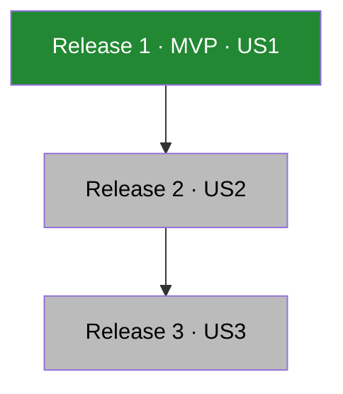
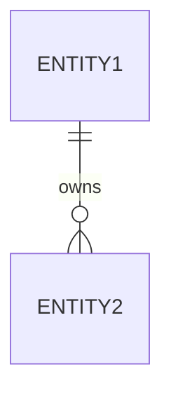
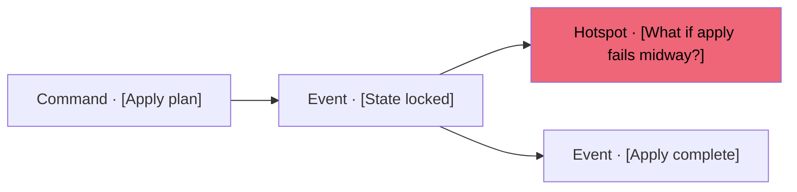
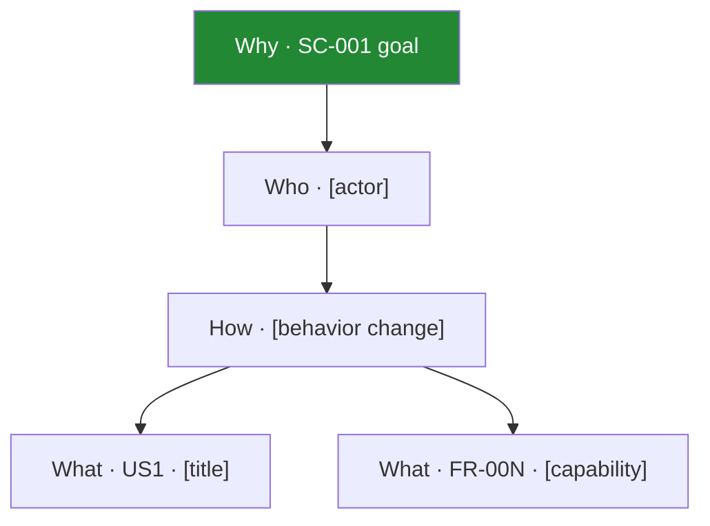
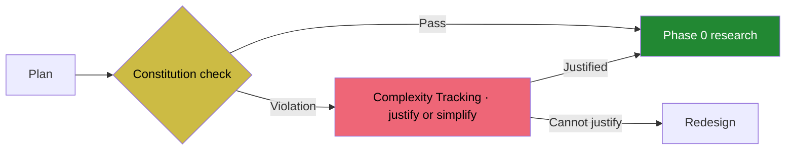
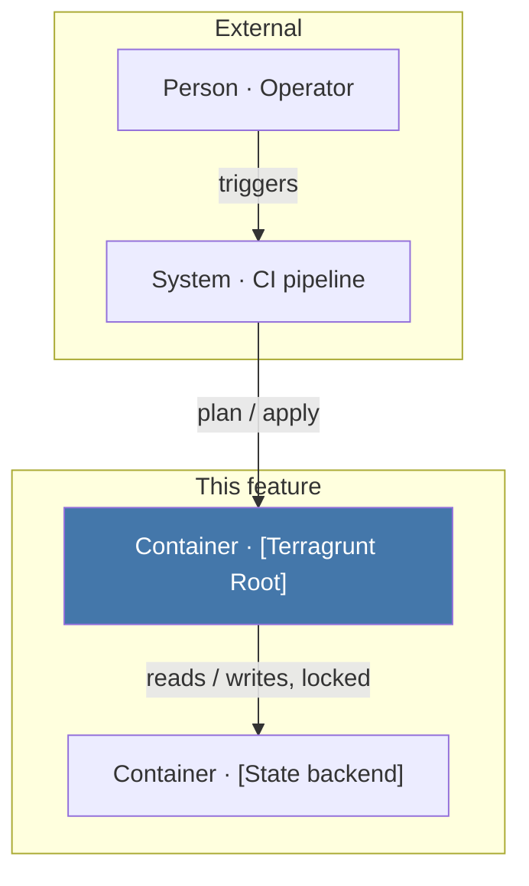
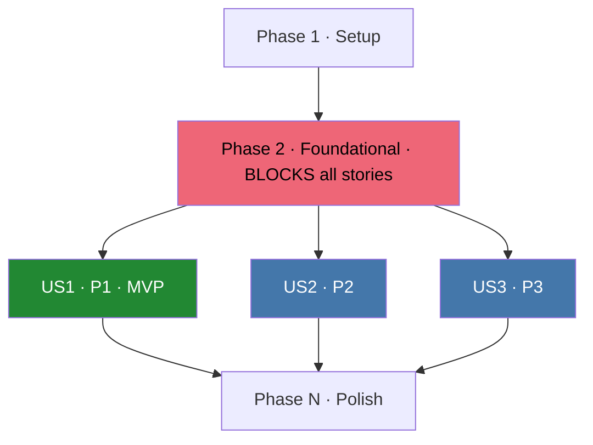
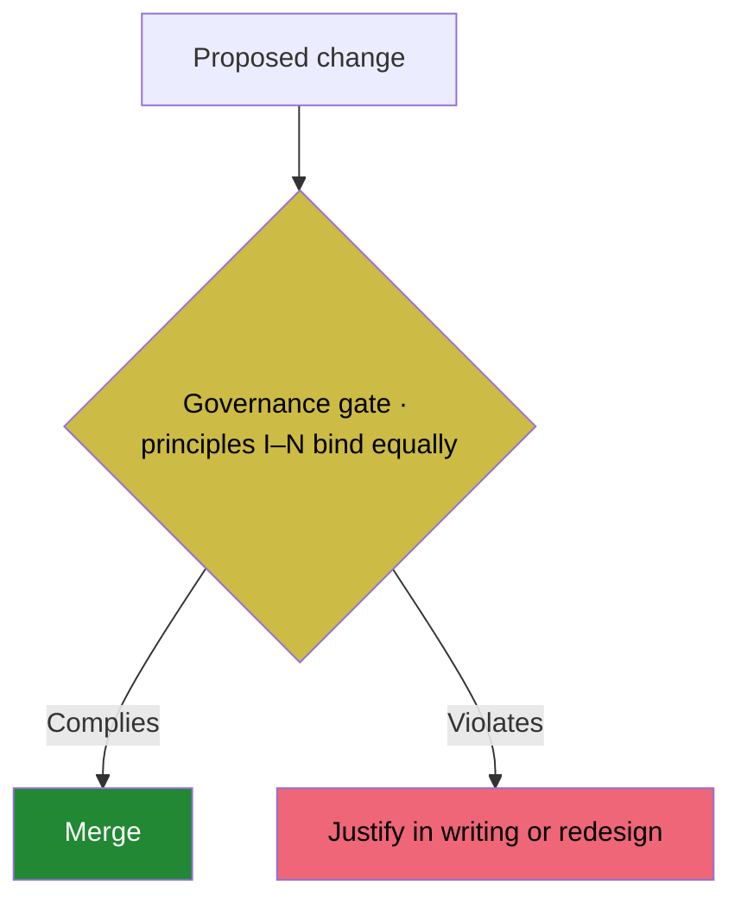
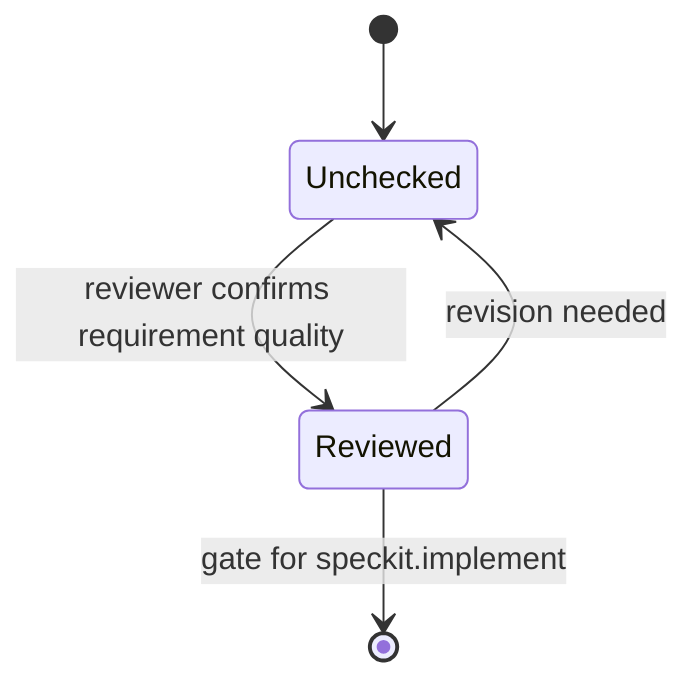

# Visual Conventions for Spec Kit Templates

**Purpose**: Decide where each Spec Kit template earns a diagram or a structured table,
which form to use, and how to author it so it renders on GitHub and VS Code and stays
fillable by the `/speckit.*` commands.
**Reader**: The author or command filling in a `spec.md`, `plan.md`, `tasks.md`,
constitution, or checklist, and every reviewer who reads it afterward.
**Status**: Reviewed proposal. Grounded in a books-and-prior-art review (sources at the
end) and cross-checked against the consuming project's VIS / palette rules; default
palette is Paul Tol Bright as listed in Design Rules, and the diagram rule
`docs/diagrams.md`.

Each template describes a *structure*, a release map, a dependency graph, an entity model,
a governance gate, that today the prose forces the reader to rebuild in their head. The job
of this document is to name the one question each section answers and pick the honest form
for it, which is often a comparison table rather than a picture.

## Design Rules

These rules changed from the first draft after review. Read them before adding any visual.

1. **One named question per diagram, not one diagram per template.** A picture earns its
   place only when it answers a question the prose leaves the reader to reconstruct
   (VIS-01; ISO/IEC/IEEE 42010 "one concern per view"; Martraire, one diagram one story). A
   second picture answering the same question is forbidden.
2. **The title is a rendered Markdown line above the fence, phrased as the question.** A
   Mermaid `%%` comment is discarded and never appears on GitHub or in VS Code (VIS-10). Add
   `accTitle:`/`accDescr:` inside the fence as the accessibility channel, and keep a
   one-sentence reading of the graph in prose.
3. **Prefer a table when the task is lookup.** Traceability, decisions, targets, and
   registers are matrices. Position on shared rows and columns beats a graph, needs no color
   key, and always renders (VIS-02; Tufte, tables for exact values).
4. **Reserve Mermaid for topology.** Dependencies, boundaries, cardinality, and real state
   transitions are graphs. Do not draw a graph of a list.
5. **Omit the visual when a list, tree, or existing table is already clearer.** An empty
   ceremony diagram violates VIS-04 and Martraire's low-effort principle.
6. **Fixed topology, filled labels, deleted spares.** Commands substitute labels into a
   fixed shape. If a spec has two stories, the third node is deleted, never left as a
   dangling `US3` placeholder.
7. **Color is nominal, restated in the label.** Hue marks a kind (MVP, blocking gate,
   external system), never a rank; rank is position (Bertin; VIS-12). Tol Bright is not
   greyscale-safe, so every fill meaning also lives in the node text (VIS-08).

## Tooling Contract

**Standardize on Mermaid fenced blocks plus GitHub Markdown tables.** Mermaid is the only
diagrams-as-code language GitHub renders natively in Markdown, and VS Code 1.121 ships it
built in. PlantUML, D2, Graphviz, and Excalidraw need a CLI, a CI render step, or an
extension, so they are wrong for LLM-filled templates that must render on github.com with no
build. If a feature later needs a C4-PlantUML or D2 poster, it lives in `docs/` with a
committed SVG, not in Spec Kit output.

**Allowed diagram types** (stable on GitHub and VS Code):

| Type | Use | Note |
|------|-----|------|
| `flowchart` (`TD`/`LR`) | Gates, DAG, release map, boundary map, impact map | Best-tested type. Prefer over legacy `graph`. |
| `erDiagram` | Key Entities | Conceptual model, crow's-foot cardinality. |
| `stateDiagram-v2` | Checklist marker lifecycle | Keep to a few states. |
| Markdown table | Traceability, decisions, scorecards, registers, matrices | Not Mermaid. Always renders. |
| `sequenceDiagram` | One acceptance path, optional | Only when the story is an ordered message exchange. |

**Banned in templates** (experimental or unsupported on GitHub's bundled Mermaid, they
render as raw text): `C4Context`, `C4Container`, `C4Component`, `mindmap`, `sankey`,
`timeline`, `quadrantChart`, `journey`, `pie`, `gitGraph`, `block-beta`,
`architecture-beta`, `kanban`, `xychart-beta`. For a C4-style view use a `flowchart` with
`subgraph` boundaries.

**Coloring and validation** (binding: `docs/diagrams.md`):

- **Set colors with `classDef` and `class` only.** Never use `%%{init}%%` or
  `themeVariables`; the gate fails any block carrying `%%{init}%%`. Every `class`/`:::`
  reference MUST have a matching `classDef`, and every classed node id MUST exist.
- **Reuse one class vocabulary across diagrams** so a color means the same thing everywhere
  (VIS-F): `fork` red = blocking or violation or forked, `pass` green = MVP or pass or
  clean, `base` blue = primary unit, `gate` yellow = decision, `later` grey = later or
  default, `event` cyan.
- **Validate before committing** with the mermaid parse gate (pinned mermaid@12, parses
  every block under a headless DOM, enforces the `%%{init}%%` ban). The installed copy is
  `.specify/extensions/diagrams/scripts/validate-mermaid.mjs`; in this repo run
  `bun scripts/validate-mermaid.mjs`. A partial block count is a gate defect, not a pass.

**Syntax footguns:**

- **Prefer short single-line labels.** `<br/>` works in flowchart and ER node labels (other
  diagrams in this repo use it), but GitHub's sanitizer has broken it in production, so keep
  labels short and split with ` · ` where a break is not essential.
- **Quote any label with brackets or punctuation**, so `[Entity1]` and `SC-001` do not
  parse as nested shapes: `G["Why · SC-001"]`.
- **Never write a lowercase `end`** as a node; it breaks flowcharts. Use `End`.
- **Verify a new type on GitHub** with a ` ```mermaid info ` block, not only mermaid.live;
  GitHub lags upstream.

**Palette and contrast** (Paul Tol Bright): blue `#4477AA`, red `#EE6677`, green `#228833`,
yellow `#CCBB44`, cyan `#66CCEE`, purple `#AA3377`, grey `#BBBBBB`. White label text is
legible only on Bright **blue, green, and purple**; use **dark text (`color:#000`)** on red,
yellow, and cyan fills. Shared meaning across every template: red = blocking or violation,
green = pass or MVP, grey = later or default.

---

## spec-template.md

### User Scenarios and Testing (default when 2+ stories) — release map

**Do not** chain `US1 → US2 → US3`. The stories are independently testable, so arrows
between them imply a false dependency, and coloring P1/P2/P3 as three hues fakes a magnitude
ramp. The honest form is a Patton story map: a table whose columns are the user-journey
backbone and whose rows are cumulative release slices. The top row is the walking skeleton,
the thinnest end-to-end system that still works.

Which slice is a viable end-to-end MVP?

| Backbone → | [Activity A] | [Activity B] | [Activity C] |
|---|---|---|---|
| Release 1 · MVP (P1) | US1 · [title] | US1 cont. | — |
| Release 2 (P2) | US2 · [title] | — | US2 |
| Release 3 (P3) | — | US3 · [title] | US3 |

Optional cumulative-release flowchart when a picture is wanted (nodes are releases, not
stories, so the arrow means "builds on the shipped increment"):



### Acceptance Scenarios (default) — example map

Given/When/Then lists do not show which rule each example illustrates or which questions
remain open. An Example Mapping table does (Wynne; Adzic, Specification by Example). Fold
`NEEDS CLARIFICATION` items and unclear edge cases into the Open Questions column.

Which rules still lack an example, and which questions block this story?

| Rule (acceptance criterion) | Examples (Given / When / Then) | Open questions |
|---|---|---|
| [Rule: …] | The one where [happy path] | [NEEDS CLARIFICATION: …] |
| [Rule: …] | Given [state], When [action], Then [outcome] | — |

Optional, for the primary story only: one `sequenceDiagram` of the P1 path. Do not facet one
per story (arc42, "document only a few" runtime scenarios).

### Edge Cases (default) — decision table

A bullet per edge case hides whether each has defined behavior and a test. A decision table
makes gaps visible.

| Condition or boundary | Expected behavior | Linked FR / US | Verification |
|---|---|---|---|
| [boundary condition] | [what the system does] | FR-00N / US1 | [how it is checked] |

### Requirements to Success Criteria (default) — traceability matrix

Keep this as a table (ISO/IEC/IEEE 29148). Require every FR, US, and SC to appear at least
once, and show a missing link as `GAP` so orphan requirements and unmeasured stories pop.

Which requirements have no story or no success measure?

| Requirement | User Story | Success Criterion | Open question |
|---|---|---|---|
| FR-001 | US1 (P1) | SC-001 | — |
| FR-003 | US2 (P2) | GAP | [NEEDS CLARIFICATION: …] |

### Key Entities (conditional: a data feature with 2+ related entities) — ER diagram

Keep it conceptual: business names, relationship verbs, cardinality, few or no attributes.
Retain the prose definitions; the diagram shows relations, not meanings.

Which entities relate, and with what cardinality?



For a *process* feature (common in IaC), prefer a small EventStorming-style flow instead of
an ER diagram (Brandolini). Show at most three kinds, each named in the label:



### Success Criteria (default) — baseline-to-target scorecard

Do not plot heterogeneous units (seconds, percent, ticket counts) on one shared axis. An
aligned scorecard preserves each unit and states the measurement source.

| Criterion | Baseline | Target | Unit | Window | Source |
|---|---|---|---|---|---|
| SC-001 | [current] | [goal] | [s / % / count] | [period] | [where measured] |

### Success Criteria (optional) — impact map

When the link from goal to deliverable is unclear, draw a four-rank impact map
(Adzic), as a `flowchart TD`, never a radial `mindmap`.

Which deliverables actually move SC-001?



### Assumptions (default) — typed register

| Assumption or dependency | Type | Consequence if false | Validation | Owner |
|---|---|---|---|---|
| [assumption] | [scope / data / external] | [impact] | [how confirmed] | [who] |

---

## plan-template.md

### Constitution Check (default) — compliance and evidence matrix

The gate is the highest-risk section, so show the actual verdict, not a generic procedure
flowchart. This repo's constitution has fifteen principles; list the ones this plan
touches, each with status and the evidence that proves it (constitution Principle V, "prove
a guardrail, do not assert it").

Does this plan pass the constitution, and where is the proof?

| Principle | Status | Evidence | Action if not Pass |
|---|---|---|---|
| II · Root-Bounded Blast Radius | Pass | [artifact or check] | — |
| IV · Least-Privilege Delivery | Violation | [what is missing] | [remediation] |
| VIII · Simplicity | Toward | [unverified] | [what would verify] |

Optional gate flowchart, only if the amendment or re-check flow itself needs explaining
(it answers a different question from the matrix):



### Project Structure (default: keep the tree; diagram conditional) — boundary map

Keep the existing fenced `text` directory tree; it answers "where do files live?" Do **not**
draw a folder flowchart such as `cli/ → services/ → models/`: it duplicates the tree,
mislabels directories as runtime components, and invents a sample-app shape that is wrong for
IaC. When the feature has two or more runtime units, add a C4-container-style boundary map
(Simon Brown), built as a `flowchart` with `subgraph` boundaries, whose boxes are real units
(Terragrunt Roots, state backend, CI, vault) and whose edges are labeled with intent.

Which runtime units does this feature touch, and how?



Structure Decision and Complexity Tracking stay prose and table (Nygard ADR: the decision is
a paragraph, the table is its consequences). No diagram.

---

## tasks-template.md

### Dependencies and Execution Order (default) — phase dependency DAG

This is the highest-value picture in the kit: roughly forty lines of prose collapse to one
graph. Generate it from the actual task IDs and dependencies. Red marks the blocking
Foundational phase, green marks the MVP story, later stories share one fill, and only stories
in the chosen release scope point at Polish. Delete story nodes that do not exist.

Which phase blocks every story, and which stories can then run in parallel?



Optional, only when internal task edges are non-obvious: a task-ID dependency table
(`Task | Depends on`). Do not repeat the DAG per phase.

**Removed: the incremental-delivery Gantt.** A `gantt` with `dateFormat X` fakes equal
durations and a unix-second axis, encoding order as bar length (VIS-05, VIS-G; Wilke,
proportional ink). Spec Kit phases have no calendar. The DAG plus the release map already
answer "what ships after the skeleton?" Use a real `YYYY-MM-DD` Gantt only if a plan
genuinely has dates.

---

## constitution-template.md

### Core Principles (default) — enforcement matrix

Do not draw `Principle 1 → Principle 2 → Governance`. The principles are independent and
"bind equally"; edges between them are fiction. The useful view is a matrix mapping each
principle to what enforces it.

Which principle is enforced by which gate?

| Principle | Governs | Enforced by |
|---|---|---|
| [I · name] | [what it constrains] | [command / gate / review] |
| [II · name] | [what it constrains] | [command / gate / review] |

### Governance (default) — governance gate

One small activity flowchart for the enforcement decision, with principles as a single
labeled node rather than linked boxes.

What happens when a change violates a principle?



Draw the amendment flow only if the amendment process is genuinely multi-stage.

---

## checklist-template.md

### Marker Semantics (default) — review-marker lifecycle

The checklist is a DO-CONFIRM quality review (Gawande), not a work tracker. State the marker
lifecycle so no reader mistakes `[x]` for "implementation done", and include the
failed-review path.

What does checking a box mean, and when may implement start?



`[x]` means the requirement-quality criterion was reviewed and satisfied, not that code is
complete. The gate opens for `/speckit.implement` only when every required item is `Reviewed`.
`/speckit.implement` reads markers and must not flip them.

---

## Do Not Add

- Progress or percent-complete Gantts and completion pies. They read as work-done, which the
  checklist and tasks markers explicitly are not.
- Radial impact `mindmap`, pie or treemap of "priority", 3D, or dual axes (VIS-02, VIS-E).
- The full EventStorming six-color sticky legend (VIS-03); show at most three kinds.
- Wardley Maps and BPMN pools/gateways inside feature templates (wrong scale, notation
  overkill, renderer risk).
- C4 Component and Code levels, or the experimental Mermaid C4 types; use `flowchart`
  subgraphs.
- A sequence diagram of the Spec Kit CLI itself inside a feature spec.
- A second diagram restating a list or an existing table with no new comparison.

## Sources

Methods: Jeff Patton, *User Story Mapping* (O'Reilly, 2014),
https://jpattonassociates.com/the-new-backlog/ ; Gojko Adzic, *Impact Mapping* (2012),
https://www.impactmapping.org/ , and *Specification by Example* (Manning, 2011); Matt Wynne,
"Introducing Example Mapping" (2015),
https://cucumber.io/blog/bdd/example-mapping-introduction/ ; Cyrille Martraire, *Living
Documentation* (Addison-Wesley, 2019); Alberto Brandolini, *Introducing EventStorming*
(Leanpub); Alistair Cockburn, "Walking Skeleton"; Michael Nygard, "Documenting Architecture
Decisions" (2011),
https://www.cognitect.com/blog/2011/11/15/documenting-architecture-decisions ; Atul Gawande,
*The Checklist Manifesto* (2009); ISO/IEC/IEEE 29148:2018 (requirements traceability).

Visual grammar: Jacques Bertin, *Semiology of Graphics* (1967/1983); William Cleveland and
Robert McGill, "Graphical Perception" (JASA, 1984); Jeffrey Heer and Michael Bostock,
"Crowdsourcing Graphical Perception" (CHI, 2010); Edward Tufte, *The Visual Display of
Quantitative Information* (1983) and *Envisioning Information* (1990); Colin Ware,
*Information Visualization*, 4th ed. (2020); Claus Wilke, *Fundamentals of Data
Visualization* (2019), https://clauswilke.com/dataviz/proportional-ink.html ; Paul Tol,
"Colour Schemes", https://sronpersonalpages.nl/~pault/ .

Architecture documentation: Simon Brown, C4 model, https://c4model.com/ ; arc42,
https://docs.arc42.org/ ; ISO/IEC/IEEE 42010; Philippe Kruchten, "The 4+1 View Model"
(1995).

Tooling: GitHub Docs, "Creating diagrams",
https://docs.github.com/en/get-started/writing-on-github/working-with-advanced-formatting/creating-diagrams
; VS Code 1.121 release notes, https://code.visualstudio.com/updates/v1_121 ; Mermaid docs,
https://mermaid.js.org/intro/syntax-reference.html ; GitHub community #204537 (`<br>`
sanitizer), #197898 (C4 not bundled); Spec Kit discussion #694,
https://github.com/github/spec-kit/discussions/694 ; W3C WCAG 2.2 SC 1.1.1.
